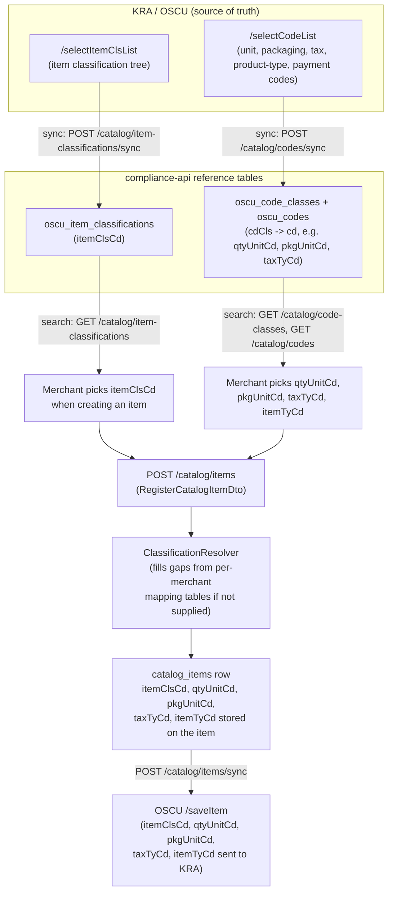
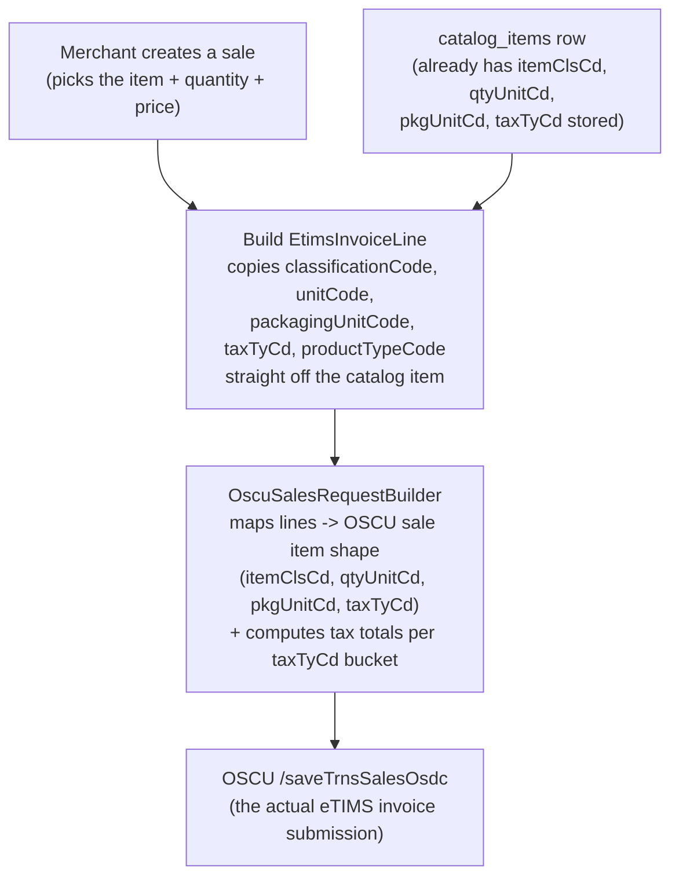

# eTIMS Reference Codes: Item Classification vs. Code Lists (Unit, Packaging, Tax, Product Type)

## TL;DR

There are **two separate KRA reference datasets**, fetched from **two separate OSCU endpoints**, stored in **two separate schemas**. `oscu_item_classifications` is **not** built from `oscu_code_classes`/`oscu_codes` — they don't combine. They're independent inputs that happen to both be required, together, on the same item and the same sale line.

| | Item Classification | Code Lists |
|---|---|---|
| **What it answers** | "What *product/service* is this?" | "What *unit*, *tax type*, *packaging*, etc. applies to it?" |
| **OSCU endpoint** | `/selectItemClsList` (spec §3.3.3.1) | `/selectCodeList` (spec §3.3.2.1) |
| **Local table(s)** | `oscu_item_classifications` (flat) | `oscu_code_classes` + `oscu_codes` (parent/child) |
| **Shape** | Hierarchical, ~5 levels, thousands of rows | Flat groups, a handful of values per group |
| **Field used on item/sale** | `itemClsCd` | `qtyUnitCd`, `pkgUnitCd`, `taxTyCd`, `itemTyCd`, `pmtTyCd`, ... |
| **Sync status (this repo)** | ✅ Built — sync + search + get endpoints | ✅ Built — sync + search + list-groups endpoints |

---

## 1. Item Classification Codes (`itemClsCd`)

KRA maintains a UNSPSC-style **product/service classification tree** — the same idea as a retail category tree, but government-mandated and used for tax analytics. Example rows straight from the OSCU spec sample:

```
itemClsCd    itemClsNm                                  itemClsLvl   taxTyCd
14111400     Paper products                              3            —
14111401     Paper Commodity products                    4            —
3133130600   Non metallic welded structural assemblies    5            B
```

- `itemClsLvl` is how deep in the tree the code sits (1 = broad category, 5 = most specific).
- Every catalog item picks **exactly one** `itemClsCd` — this is what tells KRA *what the item fundamentally is*.
- Endpoint: `POST /selectItemClsList` with `{tin, bhfId, cmcKey, lastReqDt}` → returns everything changed since `lastReqDt`.
- Local table: `oscu_item_classifications` — flat, keyed by `itemClsCd` (see `oscu-item-classification.orm-entity.ts`).
- **Status**: fully wired up as of this session — `POST /catalog/item-classifications/sync` pulls it, `GET /catalog/item-classifications` searches it, `GET /catalog/item-classifications/:itemClsCd` fetches one.

## 2. Code Lists (`cdCls` / `cd`) — unit, packaging, tax type, product type, payment method...

KRA also publishes several much smaller **flat lookup lists** — the kind of thing you'd normally put in a `<select>` dropdown. Rather than one table per list, KRA groups them all under one generic two-level model and **one shared endpoint**, `/selectCodeList`.

- `oscu_code_classes` = the **groups** (one row per list):

  ```
  cdCls   cdClsNm
  '04'    Tax Type
  '10'    Unit of Quantity
  '17'    Packaging Unit
  '24'    Product Type
  '07'    Payment Method
  ```

- `oscu_codes` = the **values inside each group**, composite key `(cdCls, cd)`:

  ```
  cdCls   cd     cdNm
  '04'    'A'    Exempt
  '04'    'B'    VAT Standard
  '10'    'U'    Pieces/item
  '10'    'KG'   Kilo-Gramme
  '17'    'NT'   NET
  '17'    'BX'   Box
  ```

  So "give me all unit-of-quantity options" = `SELECT * FROM oscu_codes WHERE cdCls = '10'`.

- Endpoint: `POST /selectCodeList` with the same `{tin, bhfId, cmcKey, lastReqDt}` shape — one call returns deltas across **all** groups at once (spec §3.3.2.1). The response is **nested**, not flat: `data.clsList[]` (one entry per `cdCls` group) each carrying its own `dtlList[]` (the individual codes in that group) — the sync use-case flattens `dtlList` into `oscu_codes` rows, attaching the parent `cdCls`, while `clsList` itself (minus `dtlList`) upserts into `oscu_code_classes`.
- Local table: `oscu_code_classes` + `oscu_codes` (see `oscu-code-class.orm-entity.ts` / `oscu-code.orm-entity.ts`).
- **Status**: fully wired up — `POST /catalog/codes/sync` pulls it (same `lastReqDt` watermark pattern as item classifications, `syncKey = 'code_list:{environment}'`), `GET /catalog/code-classes` lists the groups, `GET /catalog/codes?cdCls=&query=` searches values within (or across) groups. The hand-seed (`OscuReferenceSeed`) still runs as a bootstrap fallback so the tables aren't empty before the first live sync.

## Why two systems instead of one?

Item classification is a **big, hierarchical taxonomy** (thousands of rows, 5 levels deep) that changes independently and needs its own paging/versioning story. Code lists are a handful of **small, flat, rarely-changing dropdowns**. KRA modeled them differently at the source — this codebase just mirrors that split rather than forcing them into one shape.

---

## 3. Where these codes get used: creating an item

Every catalog item needs **one classification code + a bundle of attribute codes** before it can be registered with KRA via `/saveItem`:



Concretely, `OscuItemSaveReq` (the `/saveItem` request body) carries all five codes at once:

```ts
{
  itemClsCd,   // from oscu_item_classifications
  itemTyCd,    // from oscu_codes where cdCls='24' (Product Type)
  pkgUnitCd,   // from oscu_codes where cdCls='17' (Packaging Unit)
  qtyUnitCd,   // from oscu_codes where cdCls='10' (Unit of Quantity)
  taxTyCd,     // from oscu_codes where cdCls='04' (Tax Type)
  itemNm, itemCd, bcd, dftPrc, ...
}
```

The merchant can either supply these directly (`classificationCode`, `unitCode`, `packagingUnitCode`, `taxTyCd`, `productTypeCode` on `RegisterCatalogItemDto`) or let `ClassificationResolverTypeOrm` infer them from per-merchant mapping rules (SKU/name/external-id matching) with sane defaults as a last resort.

## 4. Where these codes get used: creating a sale

A sale line does **not** ask the user to re-pick codes. It **inherits them from the already-registered catalog item** — that's the whole point of registering the item first:



Why this matters: if an item was registered with the *wrong* `taxTyCd`, every sale of that item inherits the wrong tax treatment automatically — which is exactly why getting classification/unit/packaging/tax codes right **at item-creation time** (not sale time) is the important control point. A sale-time mistake is a per-transaction error; an item-time mistake silently repeats on every future sale of that item.

## 5. Summary — code, group, and purpose at a glance

| Code | Lives in | KRA group (`cdCls`) | Meaning | Example values |
|---|---|---|---|---|
| `itemClsCd` | `oscu_item_classifications` | — (own endpoint) | What the item *is* (product/service taxonomy) | `14111400` Paper products |
| `qtyUnitCd` | `oscu_codes` | `10` | Unit the item is counted/measured in | `U` Pieces, `KG` Kilo-Gramme, `LTR` Litre |
| `pkgUnitCd` | `oscu_codes` | `17` | How the item is packaged | `NT` NET, `BX` Box, `BL` Bale |
| `taxTyCd` | `oscu_codes` | `04` | VAT treatment | `A` Exempt, `B` VAT Standard, `C` VAT 0%, `E` VAT 8% |
| `itemTyCd` | `oscu_codes` | `24` | Product type | `1` Raw Material, `2` Finished Product, `3` Service |
| `pmtTyCd` | `oscu_codes` | `07` | Payment method (used on sales, not items) | `01` Cash, `02` Credit, `07` Mobile Money |

## 6. Current endpoints (both datasets now at parity)

| Dataset | Sync (ops-triggered) | Search / browse | Get one |
|---|---|---|---|
| Item classification | `POST /catalog/item-classifications/sync` | `GET /catalog/item-classifications?query=&itemClsLvl=&includeInactive=&limit=` | `GET /catalog/item-classifications/:itemClsCd` |
| Code lists | `POST /catalog/codes/sync` | `GET /catalog/codes?cdCls=&query=&includeInactive=&limit=` (+ `GET /catalog/code-classes` to list the groups) | — (search with `cdCls` + exact `query`) |

All four endpoints live on `CatalogController`, guarded by the same `ComplianceServiceAuthGuard` as the rest of `/catalog`. Both syncs are global reference-data pulls (not merchant-scoped output), triggered using any one merchant/branch's provisioned OSCU connection — see `SyncItemClassificationsDto`/`SyncCodeListDto` (`{merchantId, branchId, full?}`).

## 7. What's left to build

1. Validate `RegisterCatalogItemDto` overrides (`unitCode`, `packagingUnitCode`, `taxTyCd`, `productTypeCode`) against `oscu_codes` the same way an `itemClsCd` picker would, so bad codes get caught before `/saveItem` rejects them.
2. Wire a scheduled/cron trigger for both syncs (currently both are ops-triggered on demand only — see the "Sync trigger" decision in this feature's history).
3. Frontend: a classification-code picker + unit/packaging/tax dropdowns in the sync2books-react item creation form, backed by these endpoints (deferred by request — backend-only for now).
