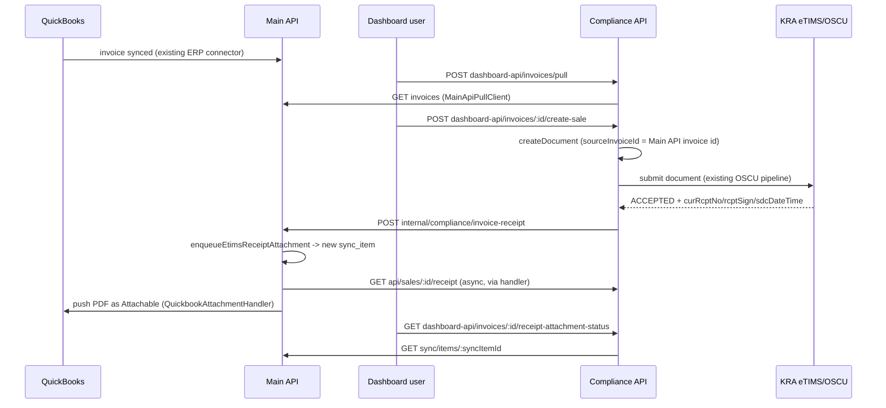

# eTIMS Receipt → ERP Attachment Pipeline

Status: built 2026-08-16. Build/tests pass in all three repos below; a full live-fire KRA round-trip (real submission → real acceptance → real attachment landing in QuickBooks) has not yet been exercised end-to-end — see [Known limitations](#known-limitations).

## What this is

An invoice pulled from an ERP (QuickBooks first; Odoo/Dynamics have a slot but no implementation yet) into the compliance dashboard gets submitted to KRA eTIMS. Once KRA accepts it, the signed receipt PDF (with QR code) is fetched and attached back onto the original ERP invoice automatically — visible in QuickBooks as a normal file attachment, and downloadable/checkable/retryable from both the compliance dashboard and the main API's ops console.

Three repos are involved, each playing a distinct, non-overlapping role:

| Repo | Role |
|---|---|
| `nest-sync-2-books-api` ("Main API") | Owns the `Invoice`, the ERP `Connection`, the generic sync/retry engine, and the actual QuickBooks attachment push. |
| `sync2books-compliance-api` ("Compliance API") | Owns the KRA/eTIMS submission, the signed receipt PDF, and the compliance-dashboard-facing proxy routes. |
| `Next-Sync-2-books-compliance-dashboard-ui` (Mode B dashboard) | Where a human reviews a pulled invoice and clicks submit; also where they see attachment status and can retry a failure. |

This flow is **Mode B**: the dashboard talks to Compliance API directly (JWT auth), never through Main API — see `THREE_SERVICE_TRUST_AND_CONNECTION_ARCHITECTURE.md` in this folder for the Mode A/B distinction. That matters here specifically because Mode B requests never carry Main API's Pattern-2 correlation headers, which is why this pipeline needed its **own** notification path into Main API rather than reusing the existing `/internal/compliance/oscu-outcome` callback (see [Why a second callback route](#why-a-second-callback-route)).

## End-to-end flow

Numbered, with exact contracts:

1. **Invoice sync (unchanged, pre-existing).** QuickBooks invoices sync into Main API's `invoices` table through the existing ERP connector. Nothing in this pipeline touches this step.

2. **Pull into the dashboard (unchanged, pre-existing).** `POST dashboard-api/invoices/pull` → `DashboardInvoicesApplicationService` → `MainApiPullClient.getInvoices()` (per-tenant `x-api-key` auth) fetches the current invoice list from Main API on demand. No local copy is created; each pull re-fetches and re-enriches against the catalog for classification status.

3. **Human review + submit — one action, not two.** The dashboard shows each pulled invoice's classification-readiness (`readyForSale`, computed and *re-checked server-side*, not just a UI decoration — `DashboardInvoicesApplicationService.createSaleFromInvoice` throws `BadRequestException` if any line is unclassified). A dashboard user clicks **"Create Sale & Submit to eTIMS"**, which always sends `submit: true` explicitly (not relying on any backend default — see [A dead end that got reverted](#a-dead-end-that-got-reverted)).

   `POST dashboard-api/invoices/:id/create-sale` (`DashboardJwtAuthGuard`) → `createSaleFromInvoice(complianceTenantId, mainApiInvoiceId, { submit }, req)`:
   - `createDocument({ ..., sourceInvoiceId: mainApiInvoiceId, ... }, { enqueueProcessing: false })` — `sourceInvoiceId` is the Main API `Invoice` id, stored on `ComplianceDocument` so the eventual notification can point back to the right invoice.
   - If freshly created (`created: true`) and `submit`: `submitDraftDocument(documentId)` runs `applyInventoryMovements → validateDocument → prepareDocument → submitDocument` (the existing OSCU submission pipeline — step 4 below), then unconditionally calls `notifyMainApiOfReceipt(...)` (step 5).
   - If **not** freshly created (idempotency matched an existing document) — see [Idempotency & self-healing](#idempotency--self-healing).

4. **KRA submission (unchanged, pre-existing).** `submitDocument` runs the existing OSCU adapter pipeline against KRA. On acceptance, `curRcptNo`/`rcptSign`/`sdcDateTime`/`intrlData` land in the document's stored KRA response, and `complianceStatus` becomes `ACCEPTED`.

5. **Notify Main API (new, Mode-B-specific).** `notifyMainApiOfReceipt` (private, `DashboardInvoicesApplicationService`) calls `Sync2BooksMainApiOscuClient.postInvoiceReceipt(...)`:
   - `POST {MAIN_API_BASE_URL}/internal/compliance/invoice-receipt`
   - Auth: `Authorization: Bearer <COMPLIANCE_CALLBACK_TOKEN>` (if set) + `x-sync2books-company-id` header — checked by Main API's `ComplianceCallbackAuthGuard`. **No sync-item correlation headers are sent or required** — this is the whole point of this route (see next section).
   - Body: `{ sourceInvoiceId, companyId, applicationId, complianceDocumentId, receiptNumber? }`.
   - Response: `{ syncItemId: string | null, syncBatchId: string | null, status: string }`.
   - Best-effort: wrapped in try/catch, logs a warning on failure, never fails the sale-creation request. If it fails or is skipped (no `mainApiCompanyId` configured yet for the tenant), the self-healing branch (step 3's else-branch) will retry it on the next call for the same invoice.
   - On success, the returned `syncItemId`/`syncBatchId` are persisted onto the `ComplianceDocument` (`mainApiSyncItemId`/`mainApiSyncBatchId`) via `correlationPersistence.patchMainApiSyncRef`.

6. **Main API creates a trackable sync_item (new).** `POST internal/compliance/invoice-receipt` (`ComplianceCallbackController`, `ComplianceCallbackAuthGuard`) validates the header matches the body's `companyId`, then calls `SyncService.enqueueEtimsReceiptAttachment(sourceInvoiceId, companyId, applicationId, complianceDocumentId, receiptNumber?)`:
   - Looks up the `Invoice` by `sourceInvoiceId`, verifies `invoice.companyId === companyId` (trust-boundary check — a compliance-api claim about which company an invoice belongs to is never taken on faith).
   - If `invoice.complianceDocumentId` already equals the incoming one (duplicate delivery), returns the existing sync_item's id/status (or `status: 'already_processed'` if none is found) — **no duplicate sync_item is created.**
   - Otherwise creates a new `sync_batch` + `sync_item` of `SyncEntityType.ETIMS_RECEIPT_ATTACHMENT`, fires processing asynchronously (fire-and-forget, matching this repo's normal queue-first pattern — see `SYNC_SYSTEM.md`), and returns immediately with the new `syncItemId`/`syncBatchId`/status (typically `pending`).

7. **Fetch + push (new, async, via the sync engine).** `EtimsReceiptAttachmentSyncHandler.syncEntity(syncItem, connection)` (registered in `SyncModule.onModuleInit`, the same handler-map pattern every other entity type uses — see `docs/HANDLER_PATTERN_EXPLANATION.md`):
   - Fetches the PDF: `ComplianceHttpService.getBuffer('/api/sales/{complianceDocumentId}/receipt', ctx)` → hits Compliance API's `GET api/sales/:id/receipt` (`ApiSalesController`, `ComplianceServiceAuthGuard`).
   - Pushes it: `AttachmentService.createSystemAttachment({ connection, entityBookId: invoice.bookId, entityType: AttachmentCategory.INVOICE, fileData: buffer, filename: 'etims-receipt-<code>.pdf', ... })`, which dispatches to whichever `IAttachmentSyncHandler` is registered for `connection.integrationKey` — today, only `QuickbookAttachmentHandler`.
   - If the attachment push itself fails, `createSystemAttachment` marks the `Attachment` row `syncStatus: 'failed'` **without throwing**; the handler explicitly checks for this and throws anyway, so a real ERP-push failure surfaces as a `FAILED` sync_item (not a silently-`SYNCED` one).
   - On success, the sync_item transitions to `SYNCED` through the normal generic sync-engine status machinery — **no bespoke status/retry code was written for this step.**

8. **Status + retry (new, dashboard-facing).** From the invoice detail screen, the dashboard calls Compliance API's proxy routes (`DashboardJwtAuthGuard`), which in turn call Main API's already-generic sync-item routes using the tenant's own `x-api-key`:
   - `GET dashboard-api/invoices/:id/receipt-attachment-status` → `GET sync/items/:syncItemId` (`ApiKeyAuthGuard`) → `{ id, status, syncErrorMessage, entityType, syncedAt }`.
   - `POST dashboard-api/invoices/:id/retry-receipt-attachment` → `POST sync/items/:syncItemId/retry` (`ApiKeyAuthGuard`, fully generic — re-runs whatever handler is registered for the item's entity type, no entity-specific code).
   - Also: any failed item here shows up for free in Main API's real ops-console sync-monitoring screen (`sync2books-react`, `app/(dashboard)/dashboard/applications/[applicationid]/sync-monitoring/`), with retry available there too — one caveat, see [Known limitations](#known-limitations).

9. **Manual download, any time (built earlier, unrelated to the auto-push above).** `GET invoices/:invoiceId/etims-receipt` on Main API (`ApiKeyAuthGuard`) proxies the same Compliance API receipt route for anyone who just wants to download the PDF, independent of whether the auto-attach step ever ran or succeeded.

## Why a second callback route

Main API already had `POST internal/compliance/oscu-outcome` for compliance-api to report an outcome back — but that route requires a real, pre-existing `syncItemId`/`syncBatchId` to correlate against (it 404s otherwise), because it was built for **Mode A**: operations Main API itself initiated (forwarded through `EtimsComplianceSyncHandler`), which always have a sync_item already. Mode B submissions (the dashboard talking to Compliance API directly) never have one — Main API was never in that request's path. `POST internal/compliance/invoice-receipt` exists specifically to *create* the sync_item rather than look one up, using the same auth guard but skipping the correlation-id requirement entirely.

## Idempotency & self-healing

`createDocument`'s dedup key is `merchantId:sourceDocumentId:documentType` (see `THREE_SERVICE_TRUST_AND_CONNECTION_ARCHITECTURE.md`'s idempotency section). If a document already exists under that key — because it predates `sourceInvoiceId` existing at all, or a prior run got interrupted before submitting/notifying — `createSaleFromInvoice`'s `!createResult.created` branch self-heals rather than silently doing nothing:

1. If the existing document's `sourceInvoiceId` doesn't match this call's invoice id, it's patched in (`SalesService.patchSourceInvoiceLink`).
2. If the existing document is still `DRAFT` and `submit` is true, it's submitted now (`submitDraftDocument`).
3. If the existing document is already `ACCEPTED`/`SUBMITTED` but has no `mainApiSyncItemId`, `notifyMainApiOfReceipt` is called now.

**This only ever runs on the invoice-linked path.** A manually-entered sale (created via `DashboardSalesController.createSale` / `ApiSalesController.createSale` from scratch, not from a pulled invoice) never has a `mainApiInvoiceId` to backfill from in the first place — `sourceInvoiceId` correctly stays `null` for those forever, and none of this self-healing logic ever runs for them, because there's no ERP invoice for a receipt to attach to.

## A dead end that got reverted

An earlier pass at this feature added a DRAFT-by-default / separate-"submit the draft"-endpoint split to `createSaleFromInvoice`, on the assumption that "pulled invoice arrives as a draft, human reviews, human submits" needed new backend state. It didn't: the dashboard's "Create Sale & Submit to eTIMS" button already always sends `submit: true` explicitly (never relies on a backend default), and the real human-review gate is the server-enforced classification-readiness check (`readyForSale`), which already existed. The DRAFT default and the `POST dashboard-api/sales/:id/submit` endpoint were reverted entirely — confirmed zero callers across all three repos before removal. `submitDraftDocument()` survives as an internal shared helper (the validate→prepare→submit sequence, DRY across the three places that call it right after creation), just not exposed as its own public "submit an existing draft" route.

## Data model additions

| Repo | Change |
|---|---|
| `sync2books-compliance-api` | `ComplianceDocument.sourceInvoiceId`, `.mainApiSyncItemId`, `.mainApiSyncBatchId` (all nullable). No migration file — this repo runs `synchronize: true` with no migrations directory. |
| `nest-sync-2-books-api` | `invoices.compliance_document_id` (nullable `varchar(255)`), migration `src/migrations/037-add-compliance-document-id-to-invoices.sql`, index `IDX_invoices_compliance_document_id`. |
| `nest-sync-2-books-api` | New `SyncEntityType.ETIMS_RECEIPT_ATTACHMENT = 'etims-receipt-attachment'`. Also required adding this key to `AttachmentService.mapSyncEntityTypeToAttachmentCategory()`'s `Record<SyncEntityType, AttachmentCategory>` — that mapping is compile-time-forced, any future new `SyncEntityType` will need the same. |

## Retry & monitoring model

The attachment push is a first-class `sync_item`, not a fire-and-forget side effect — deliberately, so it inherits Main API's existing generic retry/monitoring machinery instead of needing its own:

- **Retry** (`POST sync/items/:syncItemId/retry`) works for any entity type with zero entity-specific code — it looks up whichever `IEntitySyncHandler` is registered for the item's `entityType` and re-runs it. `EtimsReceiptAttachmentSyncHandler` slots into that map like any other handler.
- **Ops-console monitoring** (`sync2books-react`'s real sync-monitoring screen, not the dead mock one under `views/sync-monitoring/`) renders `entityType` as a plain string and offers retry on any failed row generically — this entity type appears there automatically.
- **Caveat**: the ops console's entity-type *filter dropdown* is a hand-maintained enum on the frontend (`src/domain/entity/Sync/Sync.ts`) that has already drifted from the backend's `SyncEntityType` (missing values, some casing mismatches like `bill_payment` vs `bill-payment`) — pre-existing bug, not introduced here, but it means this new type's rows appear in the table without being filterable by name until that frontend enum is fixed too.
- **Compliance-dashboard retry** is a separate, purpose-built pair of proxy routes (step 8) rather than reusing the ops console — the compliance dashboard has no other bridge into Main API's sync engine, so this was net-new plumbing on both sides, reusing Main API's already-generic retry endpoint rather than adding a new one there.

## Known limitations

- **No live-fire verification yet.** Build and unit tests pass in all three repos, and every contract between them was verified by direct code inspection (matching paths/shapes on both sides), but a real KRA submission → acceptance → callback → attachment-in-QuickBooks round-trip has not been run end-to-end. Testing this hit an unrelated dev-environment issue: `sync2books-compliance-api`'s inventory stock is an **in-memory stub that resets on every restart** (documented in that repo's own `CLAUDE.md`), and several stale `nest start --watch` zombie processes had to be killed first — the resulting stock reset blocked `submitDraftDocument`'s inventory check before a real submission could be tested. Not a code defect; just needs a normal dev/eTIMS-testing session (see the `etims-golive-testing` skill) to actually exercise.
- **Odoo/Dynamics attachments are not implemented.** `IAttachmentSyncHandler`/`registerHandler()` is ready for them; only `QuickbookAttachmentHandler` exists. An unsupported `integrationKey` fails the attachment explicitly (`syncStatus: 'failed'`), not silently.
- **`GET sync/items/:syncItemId` has no ownership scoping** — it takes only the raw sync item id, no `applicationId` check. Fine for this internal-proxy use case today; would need scoping if ever exposed more broadly.
- **The ops-console entity-type filter dropdown** needs a small, separate frontend fix (see above) before this entity type is filterable there — not blocking, since unfiltered rows already show it.

## File index

**`sync2books-compliance-api`**
- Receipt PDF: `src/sales/application/sales.service.ts` (`getEtimsReceiptPdf`), `src/sales/application/receipt/etims-receipt-pdf.generator.ts`, routes on `src/sales/controller/api-sales.controller.ts` and `dashboard-sales.controller.ts`.
- Invoice-linked sale creation + self-heal: `src/dashboard-invoices/application/dashboard-invoices.application.service.ts` (`createSaleFromInvoice`, `notifyMainApiOfReceipt`, `getReceiptAttachmentStatus`, `retryReceiptAttachment`).
- Supporting `SalesService` methods: `src/sales/application/sales.service.ts` (`patchSourceInvoiceLink`, `getDocumentBySourceInvoiceId`, `submitDraftDocument`).
- Main-API client: `src/integration/platform-outbound/sync2books-main-api-oscu.client.ts` (`postInvoiceReceipt`), `src/integration/main-api-pull/infrastructure/http/main-api-pull.client.ts` (`getSyncItemStatus`, `retrySyncItem`).
- Dashboard routes: `src/dashboard-invoices/presentation/dashboard-invoices.controller.ts`.
- Entity: `src/sales/domain/entities/compliance-document.entity.ts`, `src/sales/infrastructure/persistence/compliance-document.orm-entity.ts`, `compliance-document-typeorm.repository.ts`.

**`nest-sync-2-books-api`**
- Receipt proxy: `src/invoice/controllers/invoice.controller.ts` (`getEtimsReceipt`), `src/invoice/application/invoice.service.ts` (`getEtimsReceiptPdf`).
- Binary fetch: `src/compliance/compliance-http.service.ts` (`getBuffer`).
- Webhook: `src/compliance/compliance-callback.controller.ts` (`notifyInvoiceReceipt`), `src/compliance/dto/invoice-receipt-notification.dto.ts`.
- Sync engine additions: `src/sync/domain/entities/sync-entity-type.enum.ts`, `src/sync/application/handlers/etims-receipt-attachment-sync.handler.ts`, `src/sync/application/sync.service.ts` (`enqueueEtimsReceiptAttachment`, `getSyncItemById`), `src/sync/controllers/sync.controller.ts`, `src/sync/sync.module.ts`.
- Attachment dispatch: `src/attachment/application/attachment.service.ts` (`createSystemAttachment`), `src/attachment/domain/services/attachment-sync-handler.interface.ts`, `src/attachment/application/handlers/quickbook-attachment.handler.ts`, `src/attachment/attachment.module.ts`.
- Schema: `src/migrations/037-add-compliance-document-id-to-invoices.sql`, `src/invoice/infrastructure/persistence/entities/invoice.entity.ts`.

**`Next-Sync-2-books-compliance-dashboard-ui`**
- `app/(dashboard)/invoice/_components/invoice-content.tsx` (status/retry UI).
- `src/data/repositories/InvoicesRepository.ts`, `src/ploc/invoices/InvoicesPloc.ts`, `src/ploc/invoices/useInvoicesState.ts`.
- `src/domain/entity/PulledInvoice.ts` (`ReceiptAttachmentStatus`, `RetryReceiptAttachmentResult`, `MainApiSyncItemSnapshot`).
