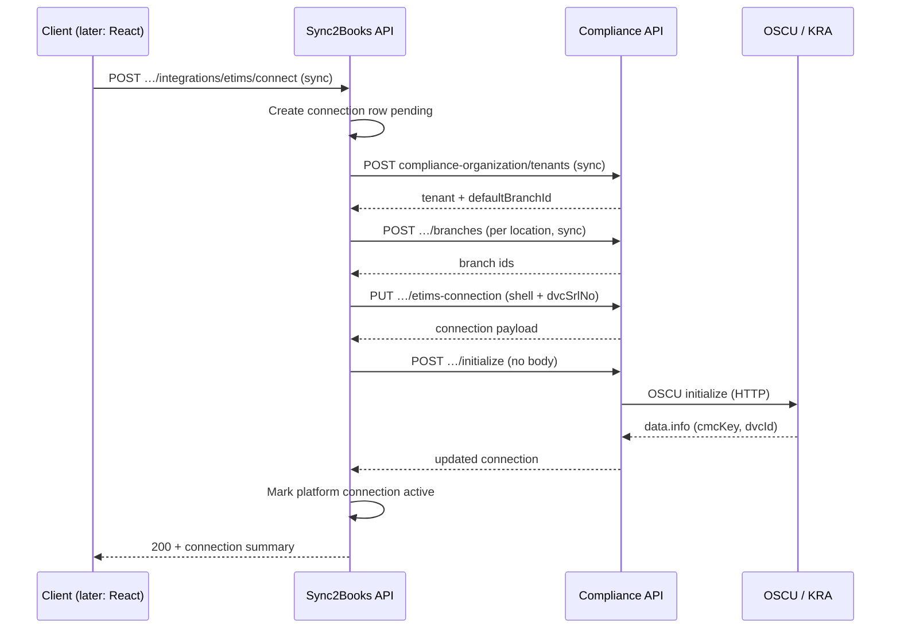
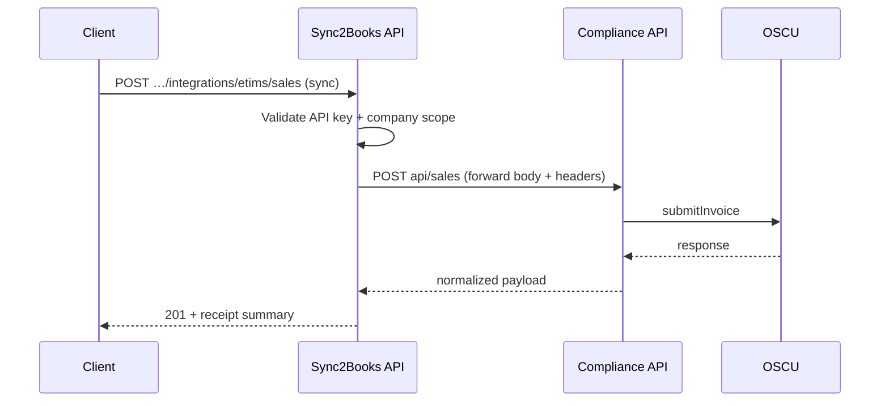

# Main API ↔ Compliance API — synchronous service contract (embedded / Mode A)

**Purpose:** Define how **Sync2Books main API** (`api/`) calls **Compliance API** (`compliance-api/`) using **synchronous HTTP** (“sync execution flow”), so engineering can implement **one closed loop** before **Sync2Books React** adds ETIMS connector UIs.

**Normative companions:**

- [COMPLIANCE_EMBEDDED_GAP_AND_SEQUENCING.md](./COMPLIANCE_EMBEDDED_GAP_AND_SEQUENCING.md) — what is missing in code + build order.
- [11-sync2books-compliance-inter-service-sla-and-communication-spec.md](./11-sync2books-compliance-inter-service-sla-and-communication-spec.md) — SLAs, retries, header ideas.
- [THREE_SERVICE_TRUST_AND_CONNECTION_ARCHITECTURE.md](./THREE_SERVICE_TRUST_AND_CONNECTION_ARCHITECTURE.md) — **Mode A** = this document; **Mode B** = dashboard-direct (out of scope here).
- [ETIMS_INTEGRATOR_PROVISIONING.md](./ETIMS_INTEGRATOR_PROVISIONING.md) — two-layer connections, correlation ids.
- [usage-manual/COMPLIANCE_ORGANIZATION_USAGE.md](./usage-manual/COMPLIANCE_ORGANIZATION_USAGE.md) — field semantics (`dvcSrlNo` vs `deviceId` / `dvcId`).

**Status:** **§5.2 operational proxy routes** remain **proposed**. **Provisioning** is **partially implemented** in `api` as **`POST /companies/:companyId/integrations/etims/provision`** (sync flow to Compliance **§6.1**). **Compliance callee routes in §6** exist in `compliance-api` (verify against `/docs` on each release).

---

## 1. Principles

1. **Sync-first:** Each user-facing operation completes in a **single request/response** across `api` → Compliance for the “seal the loop” milestone, except where KRA/OSCU latency forces documented timeouts/retries ([11…](./11-sync2books-compliance-inter-service-sla-and-communication-spec.md) §6).
2. **Thin main API:** Validate **application + company** context, enforce **authorization**, map ids, then **forward**; **no duplication** of OSCU payload rules in `api`.
3. **Compliance is source of truth** for **OSCU execution** (`cmcKey`, `dvcId`, environment, submission outcomes).
4. **Main API is source of truth** for **integration catalog** (“this company has ETIMS”) and **opaque platform `connectionId`**; Compliance stores **`sync2booksConnectionId`** where applicable.

---

## 2. Identifier mapping (embedded)

| Sync2Books (caller context) | Compliance usage |
|----------------------------|-------------------|
| `applicationId` | Propagate for audit; optional `x-application-id` header to Compliance. |
| `companyId` | **`sync2booksCompanyId`** on tenant; **`merchantId`** in catalog/sales/stock bodies **when that value is the Sync2Books company key** (today’s dev paths use the same string). |
| `branchId` / location id | **`sync2booksBranchId`** on `compliance-organization` branch rows. |
| ETIMS **platform** `connection.id` | **`sync2booksConnectionId`** on Compliance eTIMS connection row (optional but recommended for 1:1 traceability). |
| KRA office id | **`kraBhfId`** on Compliance **branch** (required before **initialize**). |

**Note:** Some Compliance operational code paths still resolve OSCU **bhfId** from ERP `branchId` vs `kraBhfId` inconsistently; provisioning **must** set **`kraBhfId`** for each branch that will call **initialize** and submit. A later hardening pass should unify **OSCU header `bhfId`** to **`kraBhfId`** everywhere.

---

## 3. Service-to-service authentication (Mode A)

Compliance **must not** accept arbitrary public Internet calls to **tenant/connection** mutating routes without trust.

### 3.1 Recommended pattern

| Mechanism | Responsibility |
|-----------|------------------|
| **`Authorization: Bearer <M2M_TOKEN>`** | JWT or static service token **issued to Sync2Books API only** (rotation, aud/iss claims). |
| **HMAC / mTLS** | Acceptable alternative if already standard in your infra. |

### 3.2 Context headers (every forward from main API)

Compliance middleware/guard should reject if required headers are missing **on integration routes**.

| Header | Example | Purpose |
|--------|---------|---------|
| `x-sync2books-company-id` | UUID | Tenant key; must match body `merchantId` / `sync2booksCompanyId` where applicable. |
| `x-sync2books-application-id` | UUID | Optional; app scope. |
| `x-sync2books-connection-id` | UUID | ETIMS **platform** connection id (after main API creates connection row). |
| `x-request-id` | UUID | Propagate for tracing ([11…](./11-sync2books-compliance-inter-service-sla-and-communication-spec.md) §8). |
| `x-idempotency-key` | string | For **repeatable** forwards (sales, stock) per [11…](./11-sync2books-compliance-inter-service-sla-and-communication-spec.md) §6.3. |

**Implementation note:** Header names are normative for **new** work; Compliance may accept aliases during migration (`x-company-id` per older spec) if documented in deployment.

### 3.3 Environment configuration (main API)

| Variable | Meaning |
|----------|---------|
| `COMPLIANCE_API_BASE_URL` | Origin only, e.g. `https://compliance.internal` (no trailing slash). |
| `COMPLIANCE_SERVICE_TOKEN` or `COMPLIANCE_SERVICE_JWT_*` | Credential used only by `api` workers. |
| `COMPLIANCE_HTTP_TIMEOUT_MS` | Default e.g. `30000`; align with SLA. |

---

## 4. Sync execution flows (end-to-end)

### 4.1 Provisioning — “connect ETIMS” (blocking)

**Objective:** After this **single synchronous** orchestration (possibly several internal HTTP calls to Compliance), main API has a **connection** in `active` (or `error` with message) and Compliance has **tenant + branch(es) + initialized eTIMS context** as required.



**Per-branch rule:** **Initialize** is **per Compliance branch** row that has **`kraBhfId`** + shell + **`dvcSrlNo`**. Multi-branch companies loop **sequentially** or return **partial success** with explicit array of branch results (product decision).

### 4.2 Operational — example “submit sale” (blocking)



---

## 5. Proposed Sync2Books Main API surface (implement in `api/`)

Base path is **illustrative** — align with your existing **company** + **connections** routers.

All routes below:

- Require existing **developer auth** (API key / bearer used today for QuickBooks flows).
- Enforce **`companyId`** in scope.
- Trigger **sync** Compliance calls as mapped.

### 5.1 Provisioning & lifecycle

| Method | Proposed route | Behavior |
|--------|----------------|----------|
| `POST` | `/applications/:applicationId/companies/:companyId/integrations/etims/provision` | Runs **§4.1** steps; body: display name, environment, branches array (`sync2booksBranchId`, `kraBhfId`, `dvcSrlNo`, …). Creates or updates **`IntegrationKeyType.etims`** connection. |
| `GET` | `…/integrations/etims/status` | Read-only aggregation: platform connection row + optional Compliance GETs (tenant by company, branches). |
| `POST` | `…/integrations/etims/disconnect` | Mark platform disconnected; Compliance policy: soft-delete vs retain audit (document choice). |

**Response shape (illustrative):**

```json
{
  "connectionId": "<platform-uuid>",
  "status": "active",
  "complianceTenantId": "<internal>",
  "branches": [
    {
      "sync2booksBranchId": "loc-1",
      "complianceBranchId": "<uuid>",
      "initialized": true
    }
  ],
  "error": null
}
```

### 5.2 Operational proxies (thin forward)

| Method | Proposed route | Forward to Compliance |
|--------|----------------|----------------------|
| `POST` | `…/integrations/etims/catalog/items` | `POST /catalog/items` |
| `GET` | `…/integrations/etims/catalog/items` | `GET /catalog/merchants/:merchantId/items` (`merchantId` = `companyId`) |
| `POST` | `…/integrations/etims/catalog/items/sync` | `POST /catalog/items/sync` |
| `POST` | `…/integrations/etims/sales` | `POST /api/sales` |
| `GET` | `…/integrations/etims/sales/:saleId` | `GET /api/sales/:id` |
| `PUT` | `…/integrations/etims/stock/adjust` (or match existing stock naming) | `PUT /api/stock/adjust` |

**Rules:**

- **`merchantId`** in forwarded JSON **must** equal **`companyId`** from path (unless you introduce an explicit remap table later).
- **`branchId`** in forwarded JSON **must** equal the Sync2Books branch key agreed at provision time.

---

## 6. Compliance API — callee reference (Mode A targets)

Assume base URL `{COMPLIANCE_API_BASE_URL}`. Paths are **relative**.

### 6.1 Organization & ETIMS bootstrap

| Order | Method | Path | Role |
|------:|--------|------|------|
| 1 | `POST` | `/compliance-organization/tenants` | Upsert tenant: `sync2booksCompanyId`, `displayName`, optional lifecycle fields per live DTO (`/docs`). |
| 2 | `GET` | `/compliance-organization/tenants/by-sync2books/:sync2booksCompanyId` | Lookup after failures (idempotent replays). |
| 3 | `POST` | `/compliance-organization/tenants/:tenantId/branches` | Upsert branches; **`kraBhfId`** required before initialize. |
| 4 | `PUT` | `/compliance-organization/branches/:branchId/etims-connection` | Shell: `kraPin`, `environment`, `dvcSrlNo`, **`sync2booksConnectionId`**, optional `status`. |
| 5 | `POST` | `/compliance-organization/branches/:branchId/etims-connection/initialize` | **No body.** Uses stored `dvcSrlNo`, `kraPin`, **`branch.kraBhfId`**. |

Authoritative JSON shapes: **`GET {base}/docs`** (Swagger).

### 6.2 Catalog, sales, stock (developer paths)

| Area | Compliance path prefix |
|------|-------------------------|
| Catalog | `/catalog` |
| Sales | `/api/sales` |
| Stock | `/api/stock` |

---

## 7. Errors, retries, and idempotency

- Map Compliance **HTTP status** to main API responses per [11…](./11-sync2books-compliance-inter-service-sla-and-communication-spec.md) §8.1.
- **4xx** from Compliance → **do not** blind-retry at main API ([11…](./11-sync2books-compliance-inter-service-sla-and-communication-spec.md) §6.3).
- **5xx / network** → main API retries with backoff when safe; Compliance remains responsible for OSCU retries per **08-retry-queue-and-idempotency-spec.md**.
- **Idempotency:** forward **`x-idempotency-key`** on mutating operational forwards; Compliance should honor or document limitations per resource.

---

## 8. Main API data model deltas (minimal)

Implementing ETIMS cleanly requires **`api`** changes beyond HTTP routes:

| Item | Recommendation |
|------|------------------|
| `IntegrationKeyType` | Add **`etims`** (`'etims'`). |
| `Connection` entity | ETIMS rarely has OAuth tokens; store **metadata** (`kraPin` masked, branch list, Compliance tenant id, **last error**) in **`connectionResponse`** JSON; keep **`status`** in sync with provision outcome. |
| Webhooks | Optional: emit `connection.updated` when ETIMS transitions pending → active / error ([11…](./11-sync2books-compliance-inter-service-sla-and-communication-spec.md) integration story). |

---

## 9. Sync2Books React (Phase 2 — after loop is sealed)

- React calls **only** **§5** main API routes (never Compliance base URL).
- UX mirrors other connectors: **connect** → provisioning payload → progress → **connected** state with **masked** identifiers.
- Detailed UI spec stays in product / UX docs; **this contract** is the backend obligation.

---

## 10. OpenAPI snapshots

Maintain **machine-readable** contracts as:

1. **`api`:** `/docs` extended with ETIMS routes when implemented.  
2. **`compliance-api`:** existing `/docs` for callee bodies.

Avoid duplicating full schemas in Markdown; update this section with **links to exported OpenAPI JSON** when available.
