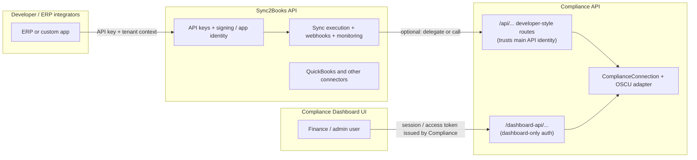

# Three-Service Trust, Auth & Connection Architecture

This document explains how **Sync2Books API** (`api/`), **Compliance API** (`compliance-api/`), and the **Compliance Dashboard UI** (`Next-Sync-2-books-compliance-dashboard-ui/`) relate to each other—especially for **ETIMS / OSCU connection context**, **developer vs dashboard** traffic, and how it ties back to the problems described in [TAX_MODULE_PAIN_POINTS_AND_SOLUTIONS.md](./TAX_MODULE_PAIN_POINTS_AND_SOLUTIONS.md).

It is **design guidance** for implementation; it does not replace per-service runbooks.

---

## 1. Why this split exists

### Pain points this addresses (from the tax module doc)

| Pain | How a clear 3-service model helps |
|------|-----------------------------------|
| **Data fragmentation & silos** | One **compliance** domain stores KRA/OSCU truth (connections, submissions, receipts); ERP data still flows through the **main API** execution path. |
| **Integration gaps between systems** | Developers keep using **API keys, webhooks, monitoring** on the main API; compliance becomes an **optional extension** (like QuickBooks), not a parallel ad-hoc integration. |
| **Audit trail & document lineage** | Compliance API owns **regulatory artifacts** (submission attempts, OSCU responses); the main API can hold **correlation IDs** without duplicating secrets. |
| **Multi-tenant / branch complexity** | **Connection context** is explicit: which **company / branch / merchant** maps to which **KRA PIN, branch ID, device, cmcKey** for OSCU. |

---

## 2. Mental model: three surfaces

- **Sync2Books API** = primary **integration platform**: API keys, apps, organizations, ERP sync pipelines, webhooks, observability.
- **Compliance API** = **regulatory domain service**: ETIMS/OSCU submission, compliance documents, **dashboard** UX for the same domain.
- **Dashboard UI** = **human-facing** compliance console; it should **not** require developers’ API keys.

---

## 3. Two authentication modes on Compliance API

Compliance API intentionally supports **two trust paths**:

| Mode | Typical caller | Credentials | Purpose |
|------|----------------|------------|---------|
| **A — Integration (developer)** | Main API (server-to-server), or ERP via main API patterns | **Propagated identity** from Sync2Books API (e.g. validated API key / internal service token / signed internal call). Compliance **does not** replace the main API’s developer auth. | Sync flows that already run inside the **API execution context** (batch jobs, webhooks, “sync like QuickBooks”). |
| **B — Dashboard** | Compliance Dashboard UI | **Compliance-issued** session / access token (and refresh if applicable). Ties **user → company → branch** to a row in `ComplianceConnection`. | Setup ETIMS, view status, manual actions, QuickBooks-adjacent **compliance** actions from the UI. |

**Rule of thumb**

- If the request **originated from an ERP/developer integration** that already authenticates to **Sync2Books API**, route compliance work through **Mode A** (main API validates keys; Compliance trusts that validation or an internal assertion).
- If the request **originated from the Compliance Dashboard**, use **Mode B** (Compliance-only tokens).

---

## 4. Connection context: one logical concept, clear ownership

### 4.1 Compliance API is the source of truth for **ETIMS execution**

For actually calling OSCU (`EtimsConnectionContext`: PIN, branch, `cmcKey`, device, environment, optional Apigee fields), **Compliance API** should persist and resolve **`ComplianceConnection`** (see `compliance-api/src/shared/domain/entities/compliance-connection.entity.ts`).

That record is the **compliance-side connection context**: everything the OSCU adapter needs **after** you’ve decided *which tenant/branch* is acting.

### 4.2 Sync2Books API may still have its own “connection” concepts

The main API already models **apps, organizations, QuickBooks connections**, etc. That layer’s “connection” is **integration topology** (which ERP, which OAuth, which company in QBO).

**Do not** assume those rows are bitwise identical to `ComplianceConnection`, but they **must correlate**:

| Main API (conceptual) | Compliance API |
|------------------------|----------------|
| `organizationId` / `companyId` (tenant) | Same tenant key you use for `merchantId` or a mapped `merchantId` |
| Branch / location / app scope | `branchId` in `ComplianceConnection` |
| — | `kraPin`, `deviceId`, `cmcKey`, `environment` (OSCU-specific) |

**Recommended pattern**

- Store a **stable correlation**: e.g. `(sync2booksTenantId, branchId)` → `complianceConnectionId` (or embed `merchantId` = tenant-scoped id both sides agree on).
- **Secrets for OSCU** (cmcKey, device, Apigee client credentials if per-tenant) live in **Compliance API** (or its secret store), not scattered in the main API—unless you deliberately centralize secrets in one vault with references only.

### 4.3 Why API might still “have ETIMS” in documentation

The main API can expose **endpoints or jobs** that *trigger* compliance (e.g. “submit invoice to KRA”). That does **not** require duplicating OSCU secrets in two databases if:

- Main API calls Compliance with **tenant + branch identifiers** + optional **idempotency key**, and
- Compliance resolves **`ComplianceConnection`** and runs the adapter.

If you cache anything in the main API, cache **IDs and status**, not full OSCU credentials.

---

## 5. Request flows (high level)

### 5.1 Developer / ERP sync (execution context = main API)

1. Client calls **Sync2Books API** with **API key** (and optional signing).
2. Main API runs its normal **sync / webhook / queue** pipeline.
3. When a step needs compliance (e.g. push invoice to ETIMS), main API calls **Compliance API** with:
   - **Service-to-service auth** (mTLS, internal JWT, or HMAC between services—choose one standard).
   - **Tenant + branch** identifiers that map to `ComplianceConnection`.
4. Compliance loads connection, builds `EtimsConnectionContext`, calls OSCU.

**Identity line:** API key → app/org → **tenant/branch** → Compliance **connection row**.

### 5.2 Dashboard user (execution context = Compliance only)

1. User logs into **Compliance Dashboard UI**; UI obtains **Compliance access token** (issued by Compliance API or your auth service dedicated to compliance).
2. UI calls **Compliance** `dashboard-api` routes with **Bearer** (or cookie session).
3. Server resolves **user → company → branch** → `ComplianceConnection`.
4. Same OSCU path as above, but **no** Sync2Books API key involved.

**Identity line:** User session → **company/branch** → `ComplianceConnection`.

---

## 6. Mapping table: “who sends what”

| Concern | Sync2Books API | Compliance API (integration routes) | Compliance API (dashboard routes) | Dashboard UI |
|--------|----------------|--------------------------------------|-------------------------------------|----------------|
| Developer API key | Yes | No (caller is trusted internal or pre-validated) | No | No |
| Compliance access token | No | Optional if you unify auth | Yes | Yes |
| `ComplianceConnection` resolution | Via IDs passed in | Yes | Yes | Yes |
| OSCU / Apigee secrets | Should not be primary store | Yes (per connection / env) | Yes | Indirect (via API) |
| Webhooks / ERP monitoring | Yes | Emit compliance events **to** main API or shared bus if needed | — | — |

---

## 7. Inter-service communication options

Pick **one** primary pattern for API → Compliance (can combine later):

1. **Synchronous HTTP** from main API to Compliance (simplest): internal base URL, service JWT, short timeouts, idempotency for submissions.
2. **Async queue** (better for spikes): main API enqueues “compliance job”; Compliance worker consumes; status polled or pushed via webhook to main API.
3. **Shared event bus** (Kafka, SNS/SQS, etc.): for larger deployments.

For **Compliance → main API** (e.g. “submission finished”), use **webhooks** or **callbacks** registered in main API—mirroring how other integrations notify the platform.

---

## 8. Security principles

- **Never** forward raw API keys from clients to Compliance “as proof.” Main API **validates** keys; Compliance trusts **asserted identity** or **signed internal tokens**.
- **Dashboard tokens** must be **scoped** to compliance operations and to **companies/branches** the user may access.
- **OSCU credentials** (PIN, cmcKey, device, Apigee secrets): encrypt at rest; rotate; audit access (supports audit-trail pain point).

---

## 9. Implementation phases (suggested)

1. **Freeze identifiers**: define `merchantId` / `branchId` mapping between main API tenant model and `ComplianceConnection`.
2. **Compliance connection module**: CRUD + secure storage for OSCU fields; dashboard routes use Mode B; integration routes use Mode A with service auth.
3. **Main API bridge**: one thin client “submit compliance document” that passes tenant + branch + payload reference.
4. **Observability**: correlation id across API request → Compliance job → OSCU `resultCd` / receipt number.
5. **Dashboard UI**: login against Compliance auth; settings pages for ETIMS connection (writes `ComplianceConnection`).

---

## 10. Relation to “extra integration like QuickBooks”

Treat **Compliance (ETIMS)** as a **first-class extension**:

- Same **mental model** as QuickBooks: main API orchestrates **when** to sync; the **connector service** (Compliance) holds **connector-specific secrets** and **vendor API** details.
- **Difference**: Compliance also serves a **standalone dashboard**, so it carries **its own user-facing auth** for Mode B—QuickBooks connector UI might be embedded differently, but the **split** (platform vs connector) is analogous.

---

## 11. Glossary

| Term | Meaning here |
|------|----------------|
| **Execution context** | Which tenant/app/job initiated the work (main API pipeline vs dashboard session). |
| **Connection context (OSCU)** | The fields in `EtimsConnectionContext` / `ComplianceConnection` needed to talk to KRA. |
| **Mode A / B** | Integration vs Dashboard authentication on Compliance API (section 3). |

---

## 12. Document maintenance

When you add new routes:

- Label them **integration** vs **dashboard** in routing prefix or module name.
- Document which **identifiers** are required (`merchantId`, `branchId`, `complianceConnectionId`).

This file should be updated when **auth** or **tenant mapping** changes.
